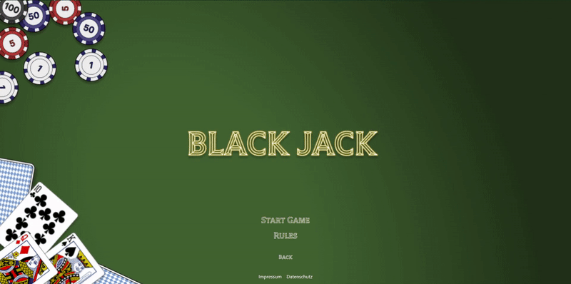
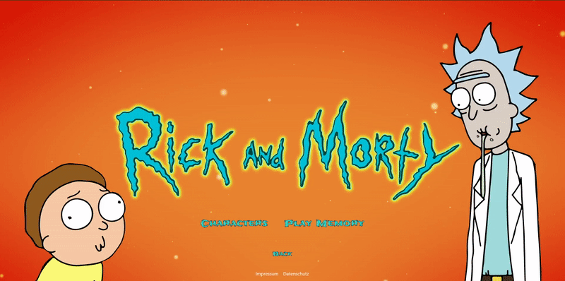

# Nuxt 3 - Games Collection

This is a small collection of two games. The first game is a Rick & Morty memory and the seconde one is a version of Black Jack.<br/>
For this project I'm using [Nuxt 3](https://nuxt.com/), the [Rick & Morty](https://rickandmortyapi.com/) and the [Deck Of Cards](https://www.deckofcardsapi.com/) API and other frameworks.

## Table of contents

- [Overview](#overview)
  - [Motivation](#motivation)
  - [Games](#games)
  - [Screenshot](#screenshot)
- [The Project](#the-project)
  - [Built with](#built-with)
  - [Setup](#setup)
  - [Development Server](#development-server)
  - [Production](#production)

## Overview

### Motivation

So what was my intention to start but also upload this project. I started this games collection in order to explore Nuxt 3.<br/>
I really like VueJS so Nuxt 3 was and is really interessting to me as it simplifyes building a complete web application a lot.<br/>
It also adresses some weaknesses of VueJS like server side rendering and SEO.<br/>
Furthermore I wanted to use this opportunity to make myself familiar with GraphQL. So I included not only a REST API but also GraphQL.<br/>
Besides that I continued to use Tailwind CSS but this time Vue components really helped to keep the HTML a little bit cleaner.<br/>
I also tried out Prettier and used ESLint to keep a consitent coding style which is important to me.<br/>
And last but least I uploaded it to further build my portfolio and also share my project setups for anybody who is looking for some inspiration.<br/>

### Games

As mentioned at the beginning the collection includes a Rick & Morty Memory and a version of Black Jack.<br/>
The Rick & Morty Memory is as the name indicates a straight forward memory game.<br/>
The implementation of Black Jack is a simplyfied version of the game. You can only play it alone against the bank.<br/>
A multiplayer feature could be part of an future update of the games collection.

### Screenshot

- Black Jack:<br/>
  <br/><br/>
- Rick & Morty Memory:<br/>
  

## The Project

### Built with

- [Nuxt 3](https://nuxt.com/)
- [Tailwind CSS](https://tailwindcss.com/)
- [Deck Of Cards](https://www.deckofcardsapi.com/) API (REST)
- [Rick & Morty](https://rickandmortyapi.com/) API (GraphQL)
- [Prettier](https://prettier.io/)
- [ESLint](https://eslint.org/)

### Setup

Install the dependencies:

```bash
# yarn
yarn install

# npm
npm install

# pnpm
pnpm install
```

### Development Server

Start the development server on http://localhost:3000

```bash
npm run dev
```

### Production

Build the application for production:

```bash
npm run build
```

Locally preview production build:

```bash
npm run preview
```
